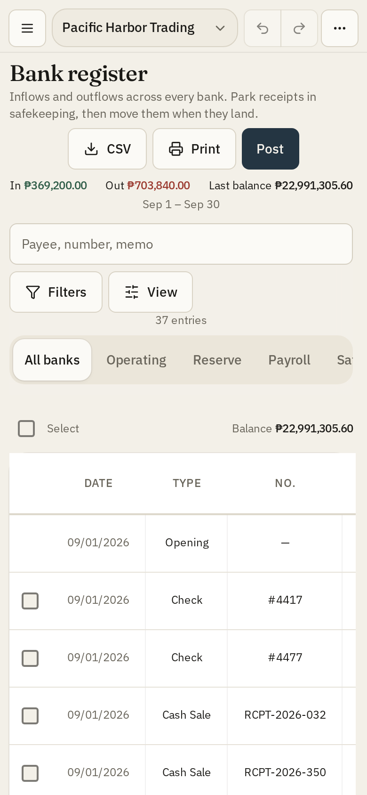

# Finance Manager v3.63.8

Treasury books in a **desktop window**, and in the browser. Banks, receipts, checks, invoices, bills, **employees**, and a **bank register**.

Pacific Harbor Trading is the default **sample company** — a full 2026 year of trading plus extra trade so the file sits near **1,000 documents**. Payee is the customer or vendor name; memo is the reason. Create more companies from the name in the header or from Settings. **Remove sample** deletes that file from this browser; **Restore last local copy** puts back the last automatic snapshot; Reload sample brings the demo back.

**License:** MIT. Light or dark. No accounts, no server, no cloud. Books stay on this computer (IndexedDB). Settings → Storage can ask the browser to keep them. Download a backup to move them.

The app mark is a **navy tile with cream pillars**. Windows uses a BMP 32-bit `.ico` (PNG-in-ICO showed as a white square). After install, delete any leftover blank shortcut and pin the new one.

## Install (fresh GitHub download)

Unzip the repo (a second unzip named `finance-manager-main (1)` is fine) so `deploy.bat` sits next to `package.json`. Then:

| Target | Double-click | What you get |
| --- | --- | --- |
| **Windows** | `deploy.bat` | **NSIS setup** (and **MSI** if WiX v3 is installed) under `src-tauri/target/release/bundle/`. Copy that installer to other PCs — they do not need Node or Rust. WebView2 is bundled. |
| **Android** | `apk.bat` (or `deploy/android/apk.bat`) | Real **Tauri APK** (same WebView app, not a PWA). Sideload `deploy/android/finance-manager-v{ver}-arm64-release.apk`. |
| **Try on this PC** | `desktop-setup.bat` | Installs Rust if needed and opens the app window. |
| **Web** | `deploy/web/build.bat` then `serve.bat` | Static `web/` folder. Do not open `file://`. |

**Windows, once:** [Node.js 22 LTS](https://nodejs.org) and [Visual Studio Build Tools](https://visualstudio.microsoft.com/visual-cpp-build-tools/) with **Desktop development with C++**. The script can install Rust. First compile is slow.

**Android, once:** Node 22, the same C++ tools + Rust, [Microsoft OpenJDK 17](https://learn.microsoft.com/java/openjdk/download) or Temurin 17 (not Android Studio JBR / JDK 25), and Android Studio SDK + NDK. The packer adds the `aarch64-linux-android` Rust target and runs `npm install` if `node_modules` is missing.

Vite is installed with the packages — no global `vite` command. `.npmrc` has `legacy-peer-deps=true`.

After the Windows installer: **delete the leftover white shortcut** and pin the new one — shortcut and taskbar both use the navy pillars tile.

## What's new in v3.63.8

- **Customers / Vendors Name resize**: the auto-fit/drag handle sits on the Name|Contact edge again (it had been painted at the far right of the page). Double-click auto-fit works on that handle. Desk keeps the handles even on a touch-capable laptop.
- **Column titles match Banks**: header row is a bottom rule only — no vertical borders on the titles.
- **Reconcile List**: rows show with the list instead of sitting empty for a few seconds. Desk opens in List like Banks.

## What's new in v3.63.7

- **List columns like a sheet**: every List (and sub-table) column has its own width. Drag and double-click auto-fit change only that column — no leftover dump into Name/Customer/Payee, no last-column stretch, no cells merging. Refresh keeps the widths you set. The card side-scrolls; empty paper stays empty.

## What's new in v3.63.6

- **Customers / Vendors column width**: drag and double-click auto-fit on Name and Contact actually change the column. No freeze-pane overlay, no CSS min-width fighting the stored width. The list side-scrolls.
- **Plain table paper**: directory, transaction history, and every other list use the same `--color-table` field — no sticky Name strip, no muted header, no edge fade.
- **Actions labels on desk**: Collect, Pay, Delete (and the rest) stay on the row. ⋯ is phone-only; lists side-scroll when the buttons need room.

## What's new in v3.63.5

- **Customers / Vendors columns**: Name and Contact stay separate cells with drag-to-resize. Tight panes scroll instead of hiding or merging Contact.
- **Status and Actions follow type size**: badges and row buttons scale with View → Type size (same `--register-font` as the list).

## What's new in v3.63.4

- **Quick Add** on posting: type a bank, payee, or expense account and choose Quick Add — same as QuickBooks. Cash sale works with no banks yet. Register, Receipts, Checks, Bills, Employees, Banks Record/Transfer, and the party sheets all type-ahead now.
- **View on every list**: Invoices, Bills, Receipts, Checks, Employees, Ledger, Banks, Customers, Vendors, and Reconcile share Register’s View (Layout Grid|List + type size). The old standalone List/Grid pair is gone; type size is the same slider as Options → Display.

## What's new in v3.63.3

- **Windows / Android one-click from a fresh GitHub zip**: `deploy.bat` and `apk.bat` use CRLF, find the repo even when the unzip folder has parentheses (`finance-manager-main (1)`), call Node by full path, and fail with a readable message. Android packer installs npm deps, Rust if missing, and the `aarch64-linux-android` target. Temurin 17 is accepted (not only Microsoft JDK).
- **README + screenshots**: current UI only; older point-release notes live in [docs/BUGS-AND-IMPROVEMENTS.md](docs/BUGS-AND-IMPROVEMENTS.md).

## What's new in v3.63.2

- **Remove sample / any DELETE confirm**: the dimmer was sitting on top of the sheet, so Remove could not be clicked after typing DELETE. Same for Purge, Close, Restore, and Register delete.

## What's new in v3.63.1

- **Android pack**: clean sync without dependencies now installs the Tauri CLI when missing, writes gitignored Gradle helpers, and emits TauriActivity from the template on a fresh gen tree.

## What's new in v3.63.0

- **One paper**: Reports, Forecast, and Options Recurring use the same white/dark table paper as Register. Print paper is white.
- **Lists**: Receipts, Invoices, Bills, Checks, Ledger, and Employees virtualize like Reconcile (Register internals unchanged).
- **Input VAT**: taxed bills split expense / Input VAT / AP (amount is VAT-inclusive). Reports → VAT shows payable vs receivable.
- **Payroll**: hourly pay is hours × rate; optional withholding posts to Payroll Withholdings (not a PH tax engine).
- **Reliability**: last keystroke flushes on close/hide; Restore last local copy skips identical backup writes.

## Screenshots

Books do **not** follow you to another phone or laptop. Download a backup on one device and restore it on the other.

## Using the books

- **Register** opens on this month. Filters → Month, Year, or All dates (last calendar year through an open end). Tick lines to delete or reassign bank. Double-click or Enter opens Post. Print is an on-screen sheet (Letter/A4 and friends).
- **Reports → Aging** stacks Receivables then Payables (never two skinny columns).
- **Close** recs every live bank, posts recurring, then locks. Reopen is a dated event (type REOPEN).
- **Employees → Pay**: salary uses the rate; hourly is hours × rate. Optional withholding posts to Payroll Withholdings (2210).
- **Backup**: Settings → Save company file (JSON). Restore last local copy is the automatic snapshot in this browser. Header Export is CSV only.

The register is still the book. See [docs/BUGS-AND-IMPROVEMENTS.md](docs/BUGS-AND-IMPROVEMENTS.md) for the full fixed/open list and older release notes.

## Deploy notes

More detail: [deploy/README.md](deploy/README.md), [deploy/windows/README.md](deploy/windows/README.md), [deploy/android/README.md](deploy/android/README.md).

This is a **Tauri 2** desktop app — not a PWA wrapper and not a packed Node `.exe`.
